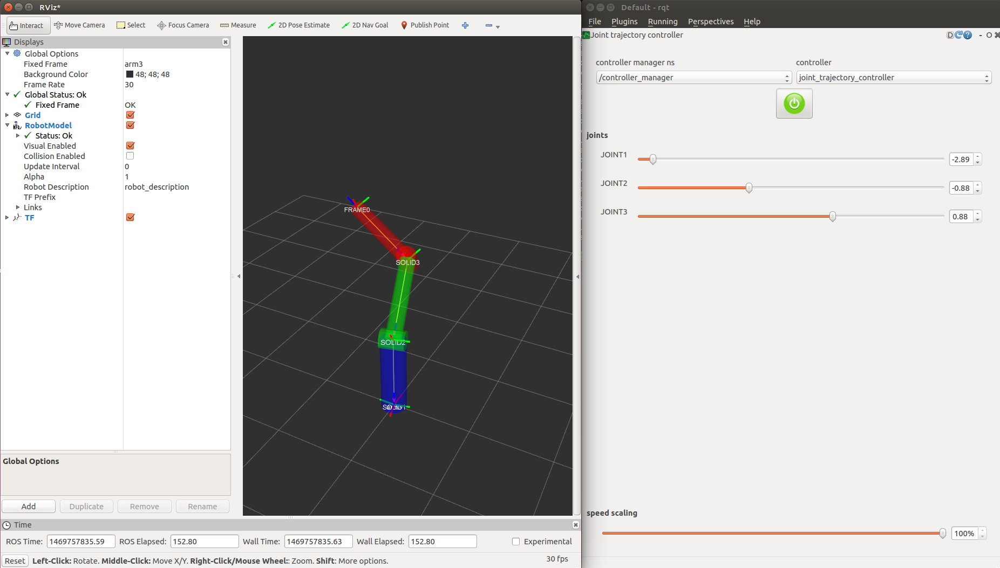

# fake_joint_driver

This package contains a node to provide
`hardware_interface::PositionJointInterface`, `hardware_interface::VelocityJointInterface`,
and `hardware_interface::EffortJointInterface`, which simply loopback
the command values to the actual feedback. In other words, it
is faking a perfect joint controller. It can be used from
ros_controllers such as JointTrajectoryController, position controllers,
velocity controllers, and effort controllers. You can check your
own joint trajectories on rviz, without using Gazebo or others.



# Quick start

## launch the nodes

On one terminal, do:

```
$ roslaunch fake_joint_driver fake-joint-driver.test
```

This launch file does:

1. Loading robot description of simple 3-DOF arm in robot/arm3.urdf.xacro
2. Launching fake_joint_driver_node and robot_state_publisher
3. Launching controller manager to spawn ros_controllers (joint_state_controller and joint_trajectory_controller)

## Supported Controllers

The fake_joint_driver supports the following controller types:

- **Position Controllers**: `position_controllers/JointPositionController`, `position_controllers/JointTrajectoryController`
- **Velocity Controllers**: `velocity_controllers/JointVelocityController`
- **Effort Controllers**: `effort_controllers/JointEffortController`

Example controller configurations can be found in the config files.

## See the robot in rviz 

On another terminal, do:

```
$ rviz
```
Add robot model to see the robot.

## Set trajectory with rqt_joint_trajectory_controller

On another terminal, do:

```
$ rqt
```

Choose Plugins->Robot tools->Joint trajectory controller to load the
plugin.  Select controller manager and controller, then you can see
sliders to set the joint trajectory goals.

# Parameters

- `main_loop_rate`

  The internal loop rate at which the robot controls are updated.
  This rate is a hard limit for joint state publishers. The default
  value is set to 100 Hz.

- `use_robot_description`

  When it is true, the driver read the parameter `/robot_description`
  to obtain the joint list to control by this driver. When it is
  false, you must specify the joint list by `include_joints`
  parameters.

- `include_joints`

  This is the list of the joints which the driver node should control.

- `exclude_joints`

  This is the list of the joints which the driver node should not
  control.

- `start_position`

  This is a map to specify the initial position of the joint. You can
  use this to avoid collision in zero joint angle.
  
  Use like:
  
  ```
  <!-- fake_joint_driver_node -->
  <node name="fake_joint_driver" pkg="fake_joint_driver" type="fake_joint_driver_node">
    <!-- Set joint start position -->
    <rosparam param="start_position">{LARM_JOINT2: -1.7, RARM_JOINT2: -1.7}</rosparam>
  </node>
  ```

# Caution

You can set target joints for joint_trajectory_controller in the
config/controllers.yaml.  Note somehow you cannot see any controllers
and joints in rqt_joint_trajectory_controller if any joints have no
joint position limits in URDF file. It is easy to be trapped.
